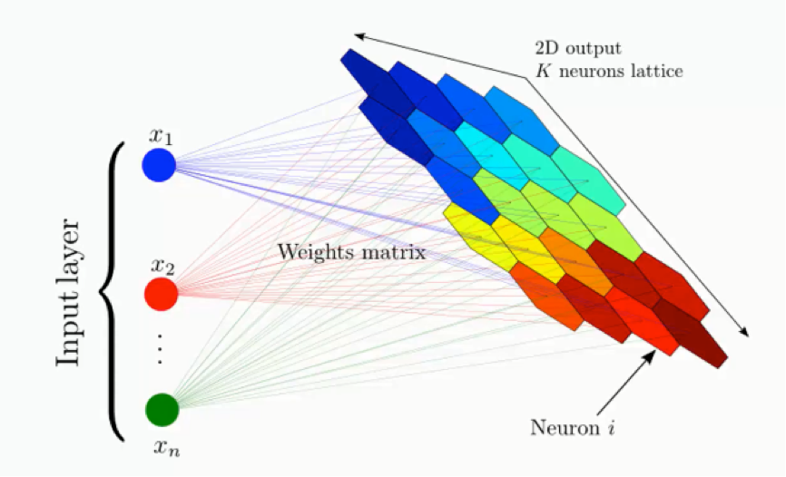
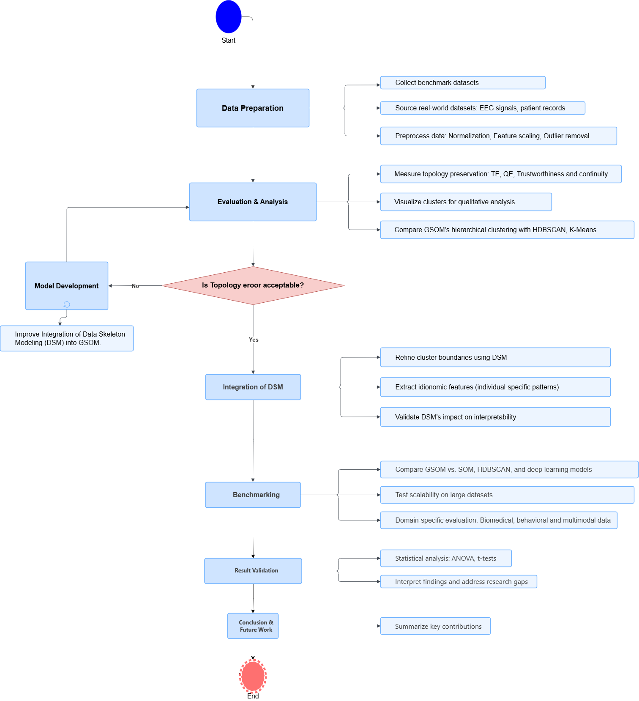

[comment]: # "This is the standard layout for the project, but you can clean this and use your own template"

# Extending the Growing Self Organizing Map (GSOM) for Unsupervised Learning-Based Modelling of Hidden Structures and Patterns in Data

#### Team

- E/19/124, Hirushi Gunasekara, [e19124@eng.pdn.ac.lk]()
- E/19/324, Bimbara Rathnayake, [e19324@eng.pdn.ac.lk]()

#### Supervisors

- Dr. Damayanthi Herath, [damayanthiherath@eng.pdn.ac.lk]()
- Prof. Damminda Alahakoon, [D.Alahakoon@latrobe.edu.au]()

#### Table of content

1. [Abstract](#abstract)
2. [Related works](#related-works)
3. [Methodology](#methodology)
4. [Experiment Setup and Implementation](#experiment-setup-and-implementation)
5. [Results and Analysis](#results-and-analysis)
6. [Conclusion](#conclusion)
7. [Publications](#publications)
8. [Links](#links)

---

<!-- 
DELETE THIS SAMPLE before publishing to GitHub Pages !!!
This is a sample image, to show how to add images to your page. To learn more options, please refer [this](https://projects.ce.pdn.ac.lk/docs/faq/how-to-add-an-image/)
 
-->

 
## Abstract
Our research extends the Growing Self-Organizing Map (GSOM) by integrating Data Skeleton Modeling (DSM) to enhance topology preservation, hierarchical clustering, and individual feature modeling for unsupervised learning. GSOM addresses limitations of traditional Self-Organizing Maps (SOM), such as fixed grid structures and topological distortions, by dynamically adapting to data complexity. The study validates GSOM's effectiveness using topology preservation metrics and benchmarks its performance against K-Means, HDBSCAN, and deep learning-based models. Real-world applications in biomedical data analysis, text mining, and behavioral analytics are explored to demonstrate GSOM's scalability and interpretability.

## Related works
* **Self-Organizing Maps (SOM):** SOM is a widely used tool for clustering and visualizing high-dimensional data but is limited by its fixed grid structure, which causes topological distortions and restricts adaptability to complex datasets.
* **Growing Self-Organizing Map (GSOM):** GSOM improves on SOM by dynamically expanding its structure based on data complexity, enhancing topology preservation and supporting hierarchical clustering for more flexible data analysis.
* **Data Skeleton Modeling (DSM):** DSM boosts GSOM’s interpretability by extracting skeletal structures from clusters, refining boundaries, and aiding feature extraction in complex, high-dimensional datasets.

## Methodology
We're tackling this project with a dynamic mixed-methods approach, broken down into three key phases:

1. **Theoretical Validation:** Compare GSOM’s topology preservation with SOM using metrics like topographic error, topographic product, Zrehen measure, and C-measure.
2. **Experimental Evaluation:** Test GSOM’s hierarchical clustering on benchmark and real-world datasets, comparing with K-Means, DBSCAN, GMM, and SOM using silhouette score, Davies-Bouldin index, and cluster purity.
3. **DSM Investigation:** Develop a framework to extract and visualize data skeletons, analyzing GSOM’s ability to model internal data structures and idionomic features in complex datasets.
 
## Experiment Setup and Implementation
* **Datasets:** Benchmark datasets from the UCI Repository (e.g., Zoo, Iris) and real-world datasets from Kaggle and open data portals.
* **Tools:** Python with libraries including NumPy, Pandas, SciPy, Pygsom for GSOM implementation, Bigtree for hierarchical visualization, and Matplotlib for plotting.
* **Implementation:** Leverage existing DSM-enhanced GSOM code, with custom modules developed for data preprocessing, topology preservation evaluation, hierarchical representation, and visualization.
* **Validation:** Multiple datasets will be used, with experiments repeated to ensure reliability, and results compared against state-of-the-art clustering methods.

## Results and Analysis
The expected outcomes include:

* Confirmation of GSOM’s superior topology preservation compared to SOM, as measured by topographic error, topographic product, Zrehen measure, and C-measure.
* Evidence of effective hierarchical clustering across diverse datasets, validated by silhouette score and cluster purity.
* Improved interpretability through DSM integration, particularly for applications in biomedical and behavioral data.
* Benchmarking results demonstrating GSOM’s performance relative to K-Means, HDBSCAN, and GMM, analyzed using quantitative metrics like the Davies-Bouldin index.

## Conclusion
We're working to establish GSOM as a robust, scalable, and interpretable tool for unsupervised learning and clustering. By integrating DSM and rigorously benchmarking against alternative methods, the study fills critical gaps in GSOM’s validation and showcases its potential for high-dimensional data analytics in domains such as biomedical research, text mining, and behavioral studies. Future directions may include combining GSOM with deep learning techniques or optimizing it for large-scale datasets.

## Publications
[//]: # "Note: Uncomment each once you uploaded the files to the repository"

<!-- 1. [Semester 7 report](./) -->
<!-- 2. [Semester 7 slides](./) -->
<!-- 3. [Semester 8 report](./) -->
<!-- 4. [Semester 8 slides](./) -->
<!-- 5. Author 1, Author 2 and Author 3 "Research paper title" (2021). [PDF](./). -->

## Links

[//]: # ( NOTE: EDIT THIS LINKS WITH YOUR REPO DETAILS )

- [Project Repository](https://github.com/cepdnaclk/repository-name)
- [Project Page](https://cepdnaclk.github.io/repository-name)
- [Department of Computer Engineering](http://www.ce.pdn.ac.lk/)
- [University of Peradeniya](https://eng.pdn.ac.lk/)

[//]: # "Please refer this to learn more about Markdown syntax"
[//]: # "https://github.com/adam-p/markdown-here/wiki/Markdown-Cheatsheet"
